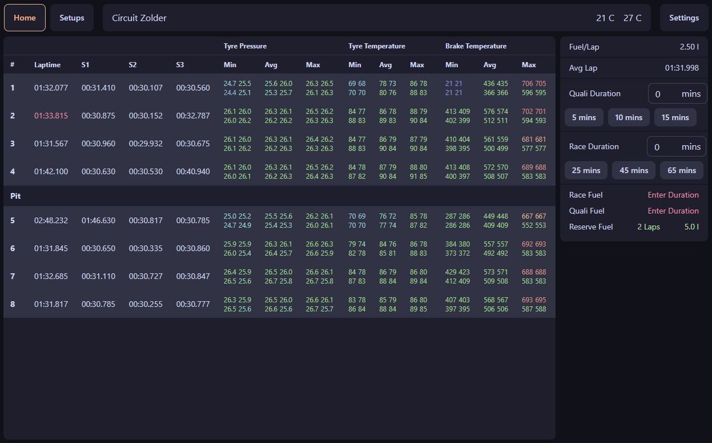
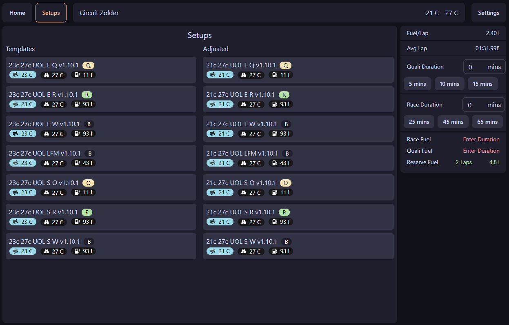

# Vapor Manager

A Small Tool for Assetto Corsa Competizione that shows basic lap telemetry and adjusts tyre pressure in setups

[TOC]

## Features
- Lap History
  - Tyre Pressure & Temperature
  - Brake Temperature
- Fuel Calculator
  - Saves previous average lap time
- Setup Adjust
  - Automatic Tyre Pressure Adjustment
  - Automatic Fuel Adjust for Quali and Race

## Images

## Installation

Download the `msi` installer from the Releases section and install it.

## Setups

You can place your setups in your Users `Documents\Vapor Manager\SetupTemplates` in the same
structure as in the ACC setup folder.

The tool will adjust the setups and temporarily add them to the ACC Setups folder
for you to load in-game. It will remove the setups from the ACC Setups folder again once
you leave the session or close the program.

You can adjust some parameters in the Settings:

- Telemetry Laps: Sets the setups telemetry laps to this amount.
  Useful for leagues which require you to log your telemetry.

- Extra Laps: Adds x amount of laps of fuel ontop of the calculated amount.
  good for adding some extra fuel for formation and cooldown lap.
